# Pearls AQI Predictor - Islamabad Forecast Lab

Pearls AQI Predictor is my end-to-end Data Sciences internship project for forecasting the next 3 days of AQI in Islamabad, Pakistan.

I built this as a working ML product, not just a notebook. The system collects live air quality data, engineers features, stores them in MongoDB Atlas, trains multiple models automatically, registers champion models, and serves predictions through a FastAPI backend and a Next.js dashboard.

## Live Links

| Item | Link |
|---|---|
| Live frontend |https://10pearls-aqi.vercel.app/|
| Forecast dashboard |https://10pearls-aqi.vercel.app//dashboard |
| Backend API | https://aqi-predictor-off9.onrender.com/ |
| FastAPI docs | https://aqi-predictor-off9.onrender.com/docs |
| Final report PDF | [documentation/Pearls_AQI_Predictor_Final_Internship_Report.pdf](documentation/Project_Report.docx) |

## Project Screenshots

<p align="center">
  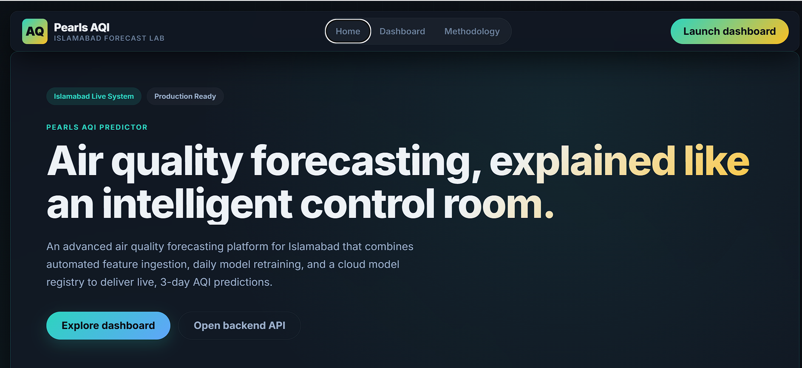
  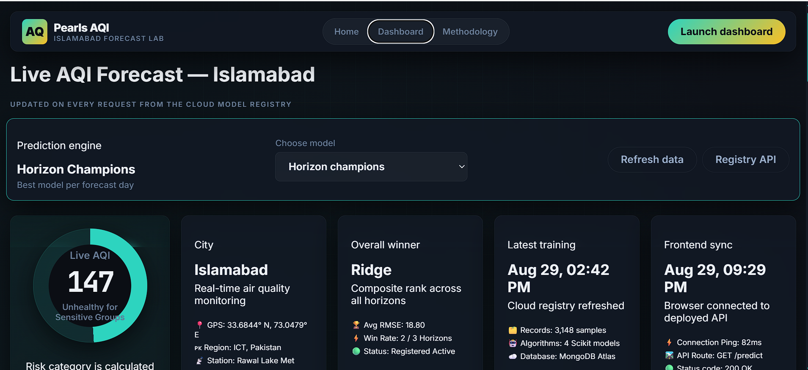
</p>

<p align="center">
  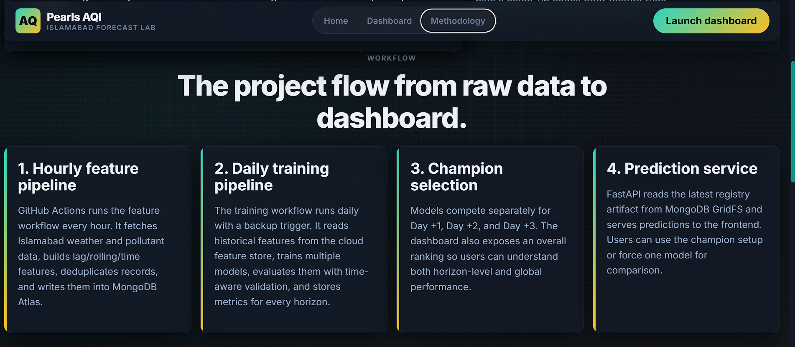
  
</p>

## What The System Does

- Predicts Islamabad AQI for Day +1, Day +2, and Day +3.
- Uses live API-based weather and pollutant data from Open-Meteo.
- Stores processed features in MongoDB Atlas as a cloud feature store.
- Trains multiple models: Ridge, Random Forest, Gradient Boosting, and MLP Neural Net.
- Evaluates models using RMSE, MAE, and R2.
- Selects champion models dynamically instead of hardcoding a winner.
- Stores model registry metadata and model binaries through MongoDB Atlas and GridFS.
- Runs automated feature and training pipelines using GitHub Actions.
- Serves predictions through a deployed FastAPI backend on Render.
- Presents results through a deployed Next.js frontend on Vercel.
- Includes EDA, feature importance style evidence, quality audit checks, and pipeline evidence.

## Architecture

```text
Open-Meteo APIs
   |
   | hourly GitHub Actions feature pipeline
   v
MongoDB Atlas Feature Store
   |
   | daily/catch-up GitHub Actions training pipeline
   v
Model Metrics + Model Registry + GridFS Artifacts
   |
   | inference endpoints
   v
FastAPI Backend on Render
   |
   | public API calls
   v
Next.js Frontend on Vercel
```


## Cloud Evidence

### MongoDB Atlas

<p align="center">
  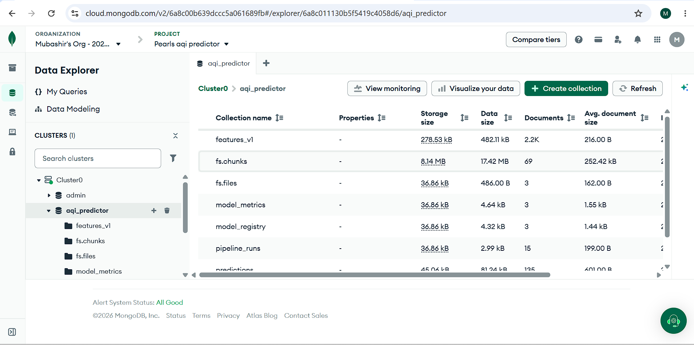
  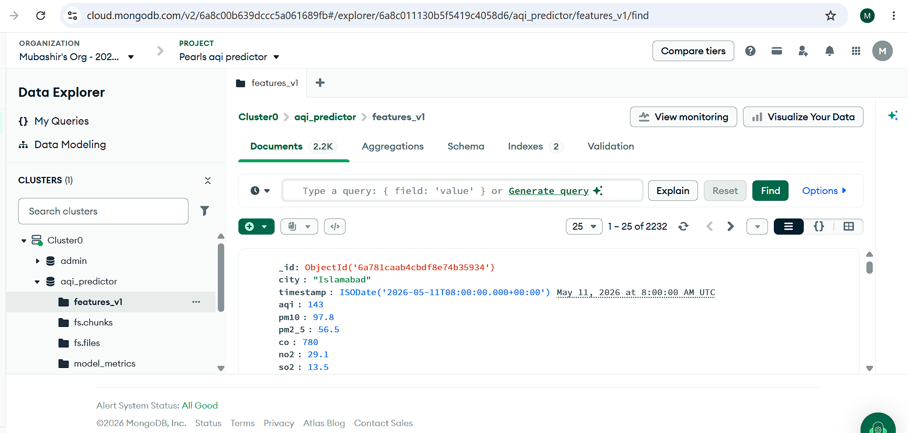
</p>
](image-1.png)](image.png)
<p align="center">
  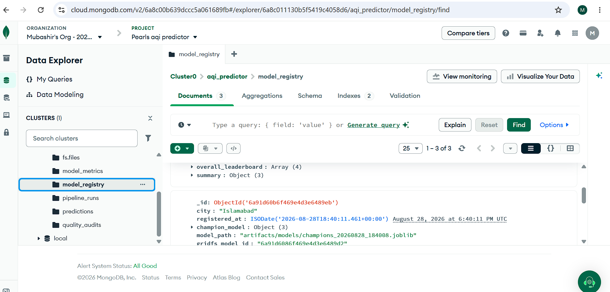
  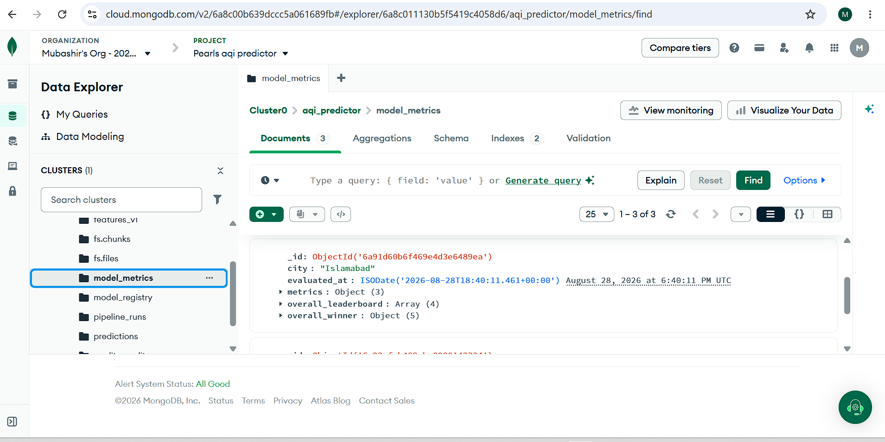
</p>

<p align="center">
  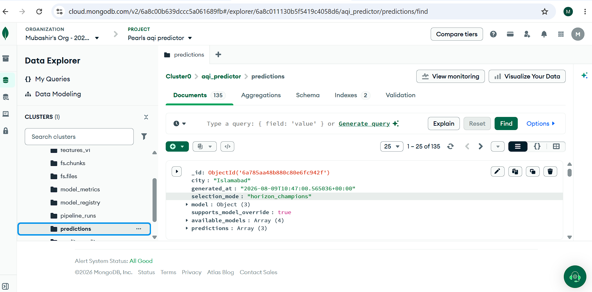
  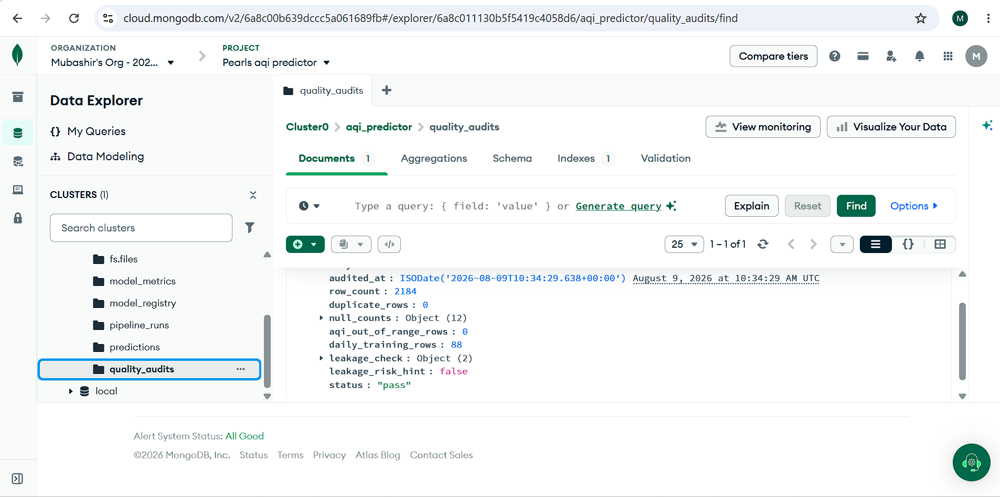
</p>

<p align="center">
  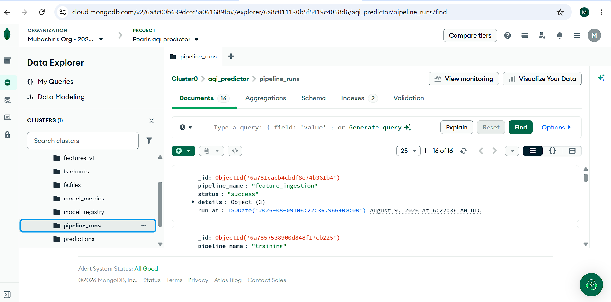
</p>

### GitHub Actions Automation

<p align="center">
  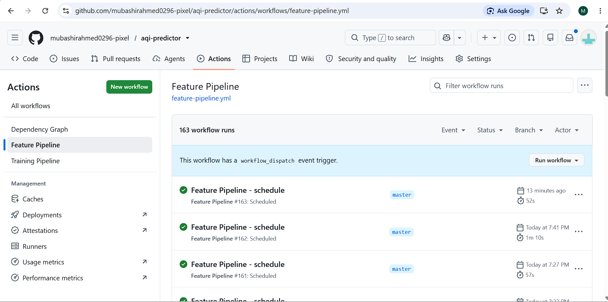
</p>

<p align="center">
  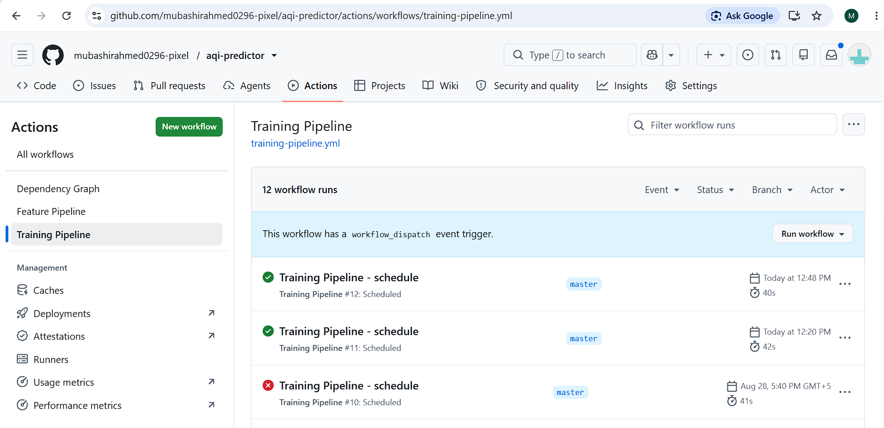
</p>

### Backend and Frontend Deployments

<p align="center">

  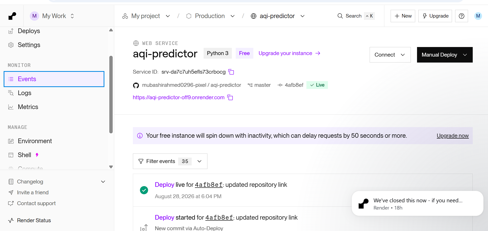
</p>

<p align="center">
  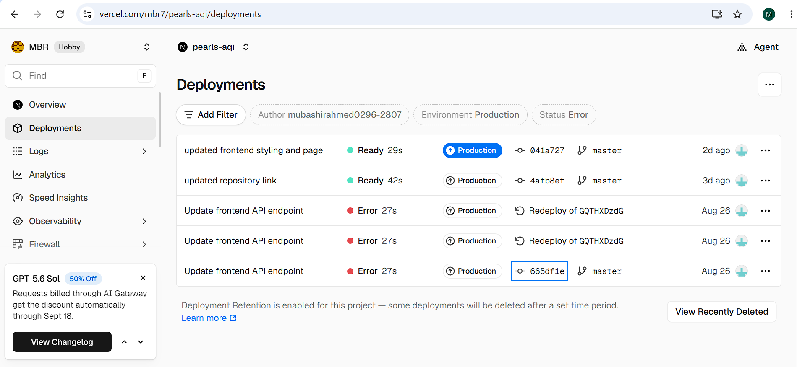
</p>

### API, EDA , SHAP Proof

<p align="center">
  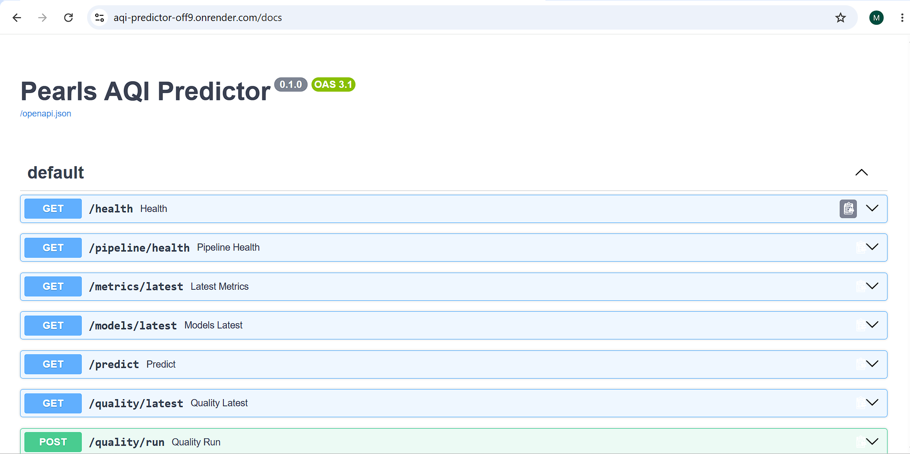
  </p>

<p align="center">
  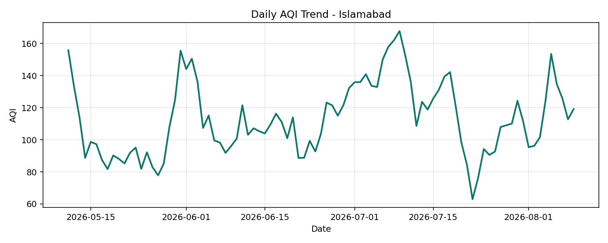
  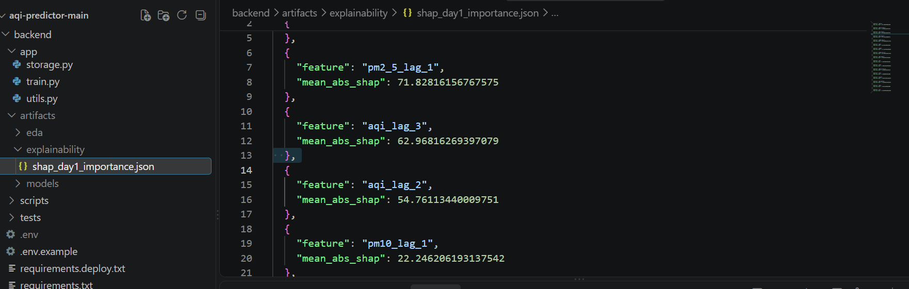</p>

## Automation Details

### Feature Pipeline

Workflow file: `.github/workflows/feature-pipeline.yml`

- Runs on GitHub Actions schedule.
- Has primary and backup cron triggers because GitHub scheduled runners can be delayed.
- Fetches current Islamabad air quality and weather data.
- Engineers features and stores them in MongoDB Atlas.
- Uses deduplication so repeated scheduled runs do not corrupt the feature store.
- Logs each run to the `pipeline_runs` collection.

### Training Pipeline

Workflow file: `.github/workflows/training-pipeline.yml`

- Runs daily and also includes catch-up logic after feature runs.
- Fetches historical feature data from MongoDB Atlas.
- Trains Ridge, Random Forest, Gradient Boosting, and MLP Neural Net models.
- Evaluates with RMSE, MAE, and R2.
- Saves model metrics, model registry records, and model artifacts.
- Generates latest 3-day prediction records.

### Manual Recovery

Workflow file: `.github/workflows/manual-recovery.yml`

This exists so I can manually recover the system if any external platform delays or skips a scheduled run.

## Repository Structure

```text
backend/               FastAPI service, database layer, feature pipeline, training code
frontend/              Next.js frontend product dashboard
.github/workflows/     Feature, training, and manual recovery automation
assets/readme/         Public screenshots used inside this README
documentation/         Final internship report PDF only
render.yaml            Render deployment blueprint
```

## Local Setup

### Backend

```bash
cd backend
python -m venv .venv
.venv\Scripts\activate
pip install -r requirements.txt
uvicorn app.api:app --reload --port 8000
```

Required backend environment variables:

```env
MONGODB_URI=your_mongodb_atlas_uri
MONGODB_DB_NAME=aqi_predictor
CITY=Islamabad
LATITUDE=33.6844
LONGITUDE=73.0479
```

### Frontend

```bash
cd frontend
npm install
npm run dev
```

The frontend reads the backend URL from its environment configuration. For local testing, point it to the local FastAPI server or to the deployed Render API.

## Final Submission

The candidate portal requested a public GitHub repository link. This repository contains the working project code, deployed frontend/backend links, automation workflows, screenshots, evidence, and final report PDF.

Final report PDF:

[documentation/Project_Report.pdf](documentation/Project_Report.docx)

## Built By

- GitHub: https://github.com/mubashirahmed0296-pixel/aqi-predictor
- Live project: https://10pearls-aqi.vercel.app/
-backend : https://aqi-predictor-off9.onrender.com